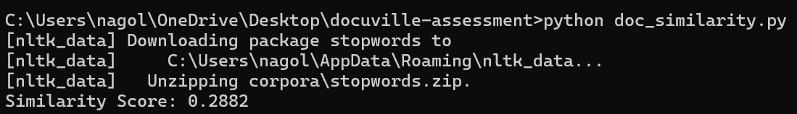

## DocuVille Document Similarity Detection
# About The Project

This project solves the problem of calculating a similarity score between two text documents using NLP techniques. It is part of the DocuVille Software Engineer Technical Assessment 2025.

# You will find:

Document comparison pipeline using TF-IDF and cosine similarity

Preprocessing like case normalization and stopword removal

CLI output for a similarity score between 0 (completely different) and 1 (identical)

# Built With

* Python

* Scikit-learn

* NLTK

# Getting Started

# Prerequisites

Ensure Python is installed:
 ```sh
  python --version
  ```
# Installation

1. Clone the repository:
 ```sh
  git clone https://github.com/Nagoluaadhi/docuville-assessment.git
  ```
2. Install dependencies:
```sh
pip install scikit-learn nltk
```
3. Make sure you have the following files:

* doc1.txt

* doc2.txt

* doc_similarity.py
# Usage

To run the program:
```sh
python doc_similarity.py
```
You will get an output like:
```sh
Similarity Score: 0.2882
```
# Sample Inputs

doc1.txt:
```sh
Artificial intelligence is transforming the world. It is used in automation, healthcare, and finance.
```
doc2.txt:
```sh
AI is changing how the world works. It has applications in healthcare, automation, and financial sectors.
```
# Design Diagram
```sh
              ┌────────────┐
              │ Document A │
              └─────┬──────┘
                    │
              ┌─────▼──────┐
              │ Preprocess │
              └─────┬──────┘
                    │
              ┌─────▼──────┐
              │ Vectorizer │ <─ TF-IDF or BERT
              └─────┬──────┘
                    │
              ┌─────▼──────┐
              │ Similarity │ <─ Cosine/Jaccard
              └─────┬──────┘
                    │
              ┌─────▼──────┐
              │ Similarity │
              │    Score   │
              └────────────┘
```
# Screenshot

Output after running script:


# Contact
* Audi Kesava Reddy Nagolu
* Email: audinagolu01@gmail.com🔗 
* GitHub: https://github.com/Nagoluaadhi🔗 
* LinkedIn: www.linkedin.com/in/audi-987aa2264🔗
